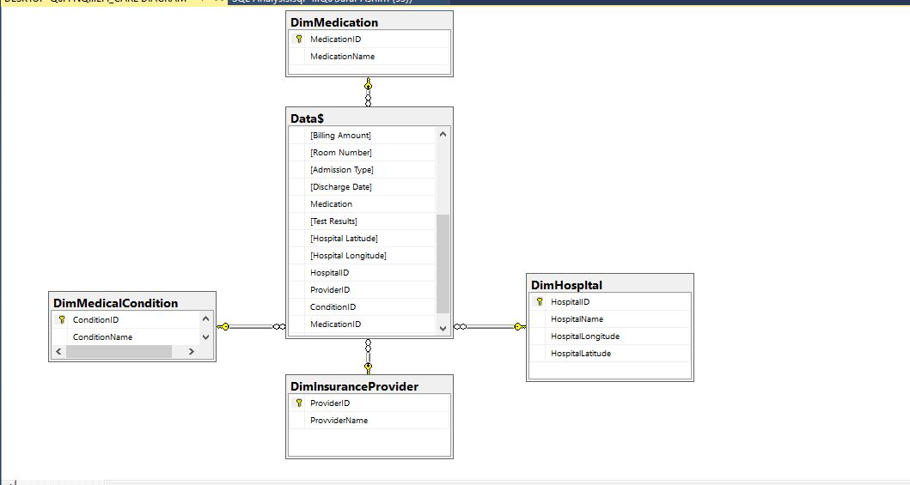

# Healthcare-Data-Analysis-With-SQL
A complete healthcare analytics project done entirely with SQL, featuring database design, data cleaning, and insightful queries on hospital operations and patient statistics.
# Introduction
The Healthcare Data Analysis Using SQL project demonstrates how structured query language (SQL) can be used to clean, organize, and analyze raw healthcare data to generate meaningful insights.
This project was completed entirely using SQL (Microsoft SQL Server) — no external analytics or visualization tools — showcasing the power of SQL for data modeling, transformation, and analytical reporting.
# Problem Statement
To uncover insights that can drive better healthcare decisions, optimize costs, and improve patient outcomes.
## Key Question
1.	What are the most common age groups, genders, and blood types among patients? Are certain groups being admitted more often than others?

2.	Which medical conditions are diagnosed the most, and do they affect certain groups of people more than others?

3.	How long do patients typically stay in the hospital for different conditions? Does this vary depending on the hospital or type of admission (emergency, urgent, or planned)?

4.	How much does treatment usually cost for each condition? Are there big differences in costs between hospitals or insurance providers?

5.	Which hospitals are treating the most patients, and how do they compare in terms of patient outcomes, like test results?

6.	What medications are most often prescribed for each condition? Are they being used consistently across hospitals?

7.	How are patients admitted - mostly through emergency, urgent, or planned admissions - and how does that impact the length of stay or treatment costs?

8.	Which insurance companies are covering the most patients, and how does that relate to treatment costs and patient outcomes?
# Skills Demonstration
- Data Modelling
- Data Cleaning
- SQL CTEs, Subqueries, Windows function, etc
- Analysis
# Data Sourcing
 I got the dataset from Onyx Data Challenge. The dataset contains 55,500 unique patient records from 10 major hospitals across the U.S. The dataset contains these fields: Patient ID,	Age,	Gender,	Blood Type,	Medical Condition,	Date of Admission,	Doctor,	Hospital	Insurance Provider,	Billing Amount,	Room Number,	Admission Type,	Discharge Date,	Medication,	Test Results,	Hospital Latitude and Hospital Longitude.	Hospital Longitude

# Data Transformation
A fact table was only given containing fiels such as age, gender, blood type, medical condition, hospital, insurance provider, medication, billing amount, admission type, and test results.
- I checked and remove duplicates
- I created Four Dimensions table namely: DimHospital(for hospitals), DimInsuranceProviders(for insurance providers), DimMedicalCondition(for medical conditions of patient), DimMedication( for medication issued).
- Exported distinct values of Hospitals to DimHospital and others to their corresponding dimensions table, then i created an ID field in all the dimensions table to serve as primary key of the Dimensions table, their coresponding foreign keys was also created in the Facts Table
- The dimensions and fact tables were connected appropriately.
- A duration field was also created to get the number of days patients spent in the hospital.
---
  The SQL queries for the data preparartion and modelling can be found [here](Data_Cleanig_Modelling_Preparation.sql).

# Modelling
a star schema was created

# Analysis/Insights
1. What are the most common age groups, genders, and blood types among patients? Are certain groups being admitted more often than others?
     - For Age Groups
        - Seniors (65+ years) were admitted the most with 17k Admissions
        - Middle-Aged (50-64) came next with 12.4k amitted patients
        - Adults (35-49) followed with 12.2k patients
        - Young Adult came next with 12k patients
        - Teenagers were admitted least with 1.6k patients
     - For Gender distribution
        - Female were admitted most with 27k patients
        - Males came next with 22k patients
        - Non-binary were the least with 5.5k admissions
      - For Blood Types
        - A+ patients were admitted most with 19k patients
        - O+ came next with 13k patients\
        - O- followed with 8k admitted patients
        - AB-, B+, A-, AB+, B- all had same number of patients admitted with 2775 patients each.
2. Which medical conditions are diagnosed the most, and do they affect certain groups of people more than others?
     - Condition Distribution
       - Diabetes and Hypertesion are the most diagnosed medical condition with 13.8k diagnoises each
       - Obesity comes next with 12.7k diagnoses.
       - Arthritis and Cancer followed with 5.5k dagnoses each.
       - Asthma is the least diagnosed with 3.8k diagnoses
     - Condition Distribution By gender
       - Females were affected more by all conditions than males except Obesity where female and male had same number of diagnoses. Non-binary was the least affected in all conditions
     - Condition Distribution by Age Group
       - The seniors had highest diagnoses of all Medical Conditions
       - The middle-aged, adult and young adult too had significant numbers
       - The Teenagers has considerably low diagnoses in all but had higher diagnoses of Hypertension, Diabetes and Obesity.
      - Condition Distribution by Blood Type
        - Arthritis were only diagnosed in O- Patients
        - Asthma and cancer were disgnosed in only A+ patients
        - Daibetes was diagnosed in O+, B+, A- patients
        - Hypertension was diagnosed in A+ and O+ patients
        - Obesity is the most widely ranged diagnosed with diagnoses in patiens such as Ab-,Ab+, B-,O-, A-.
3. How long do patients typically stay in the hospital for different conditions? Does this vary depending on the hospital or type of admission (emergency, urgent, or planned)?
   - The general average duration across all hospital, condition and admission typeis 15 days.
   - Also, across different conditions and corrresponding amission type had same average of 15 days
   - The average across different hospitals and respective condition range from 14 to 15 days.
4. How much does treatment usually cost for each condition? Are there big differences in costs between hospitals or insurance providers?
   - Treatment Cost across Conditions
     - The average treatment cost for each condition is approxmately 25k.
   - Treatment cost accross hospitals
      - The average treatment cost accross different hospital for the different conditons ranges from 24K to 26K.
      - Asthma in Mayo Clinic is the only signifacntly higher cost with average of 28K
    - Treatment Cost accross diffrent Insurance Providers is also stead with an average of 24K - 25K.
5.	Which hospitals are treating the most patients, and how do they compare in terms of patient outcomes, like test results?
   - Hospital distribution of patients
     - Houston Methodist Hospital had the highest number of patients with 20k admissions
     - Followed by John Hopkins Medical Center with 11k admissions
     - UClA came third with a total of 6K admissions
     - The next 2.5k admissions and the rest followed with not much difference from each other.
   - Hospital Distribution In terms of Test results
     - Test results that came out Abnormal were the highest in all Hospitals, followed by the inconclusive ones.
     - Normal test results was significantly low i all hospitals.
6. What medications are most often prescribed for each condition? Are they being used consistently across hospitals?
   - Medication distribution by Conditon
     - Arhtiris diagneses received Paracetamol the most, then other medications followed closely.
     - Asthma Patiens were prescribed with Paracetamol more while othe medications followed closely with not much difference
     - ASpirin was prescribed most to those with Cancer and other medications followed
     - Diabetes were prescribed most with Lipitor
     - Hypertensive patients were given Penicilin the most, other medications did not differ too much.
     - Obsese patients received Pararcetamol the most.
   - The medicaton for differet conditions in different hospitals are not quite different from each other.
7. How are patients admitted - mostly through emergency, urgent, or planned admissions - and how does that impact the length of stay or treatment costs?
   - More Patients came Electively with a number of 18.6K admissions by elective
   - Urgent admisions came next with 18.5K admissions
   - Emergency Patients come leastt with 18.2K admissions
   - The average duration of each type of admsission is still 15 days
   - tthe aveage treatment cost across all admission type is approximately 25k.
8. Which insurance companies are covering the most patients, and how does that relate to treatment costs and patient outcomes?
   - Medicare Insured Patients are the most with 27.7K patients.
   - Followed by UnitedHealthCare with 16.6K insured patients
   - Aetna and Cigna are least with 5.5K insured patients each.
   - The test results outcome does not differ from the behaviour above which is Higher number of abnormal, followed by inconclusive, followed by low number of normal results.
   - The average treatment cost across different insurance companies is 24K to 25K.
   ---
     The insight queies can be found [here](Insight_Analysis_Queries.sql)
# Recommendations
   - For Hospitals
      - Hospitals should invest in Geriatric Care Units, Chronic Disease management and Preventive screenings tailored to Seniors and women.
      - Hospitals should strengthen laboratory quality control, equipment calibration, and diagnostic training to improve test result outcomes.
      - Hospitals should cooperate with each other to redistribute patient loads, reducing overcrowding and optimizing patient outcomes.
      - Some conditions are specific to certain blood types, Hospitals should explore targeted screening or risk communication with patients with these blood types to aid earlier detection.
      - Hospitals should also invest in accommodation as many patients stay for prolonged periods
      - Hospitals should invest more in their emergency service team as number of emergency patients is almost same as number of patients that come in voluntarily.
   - For Patients
      - Patients should leverage insurance benefits and preventive care initiatives to reduce long-term healthcare costs.
      - Patients should be educated about how certain blood types may be linked to specific health risks to encourage personalized preventive care.
   - For Insurance Companies
      - Insurers can implement preventive screening incentives, wellness discounts, or disease management programs to reduce claims from chronic conditions.

       
      
